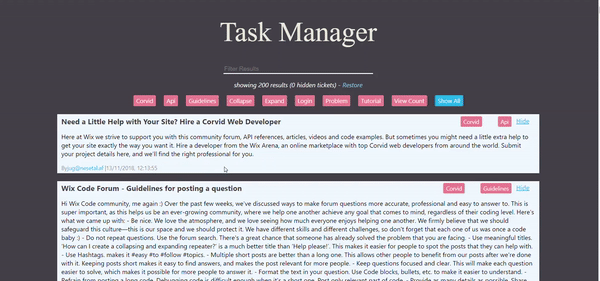

Ticket Manager

This app gathers customers tickets in a community help forum for an internet service.
link to deployed app in heroku service: https://task-manager-nir.herokuapp.com

## Backend

- The server exposes to the following API endpoints:
  - [GET] `api/tickets` - returns an array of all tickets in the database. If called with query param {`searchText`} - the API will filter only tickets that have a title including a case-insensitiveversion of the `searchText` param
  - [PATCH] `api/tickets/[:ticketId]/done` - Sets `done` property to `true` for the given ticketId
  - [PATCH] `api/tickets/[:ticketId]/undone` - Sets `done` property to `false` for the given ticketId
    Both returns `{updated: true}`

## Client

- Each ticket has a title, content, user's email, date of creation, labels and a hide button:

 
 
- The app has a search input that request the server onChange with relevant `searchText` param and filter the list accordingly.
- It is possible to filter the list by `label` name by choosing the wanted label on the label panel below the input search box.
- The hide button is hiding the tickets from view and a update the designated counter of number of hiding tickets.
- There is a button to `restore` the hidden ticket list on click and a button `show all` button that cleans all the filters and reset the tickets list.

